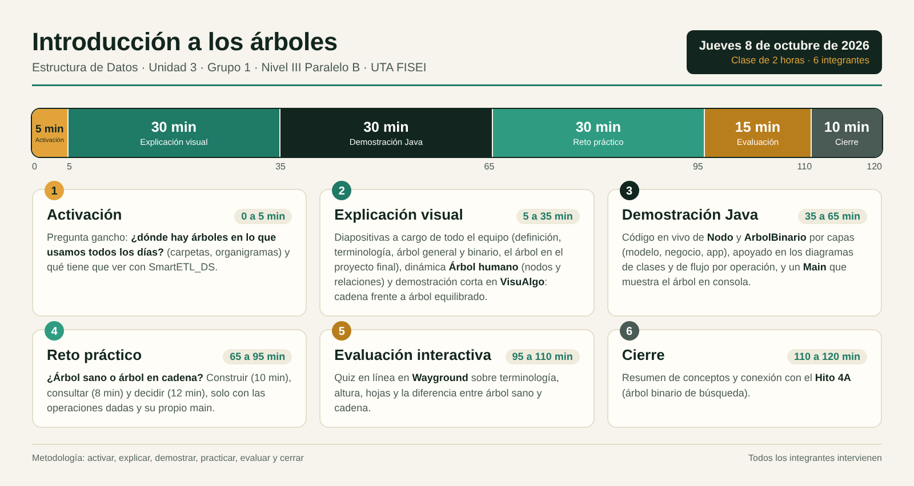
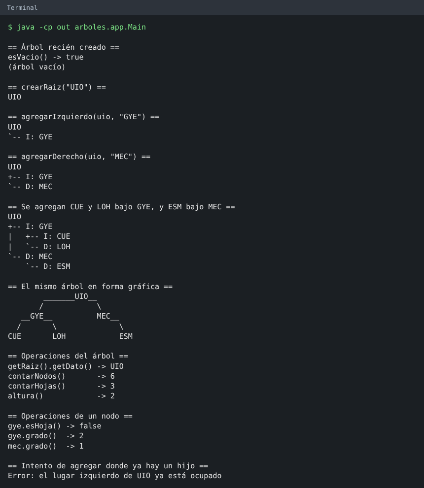
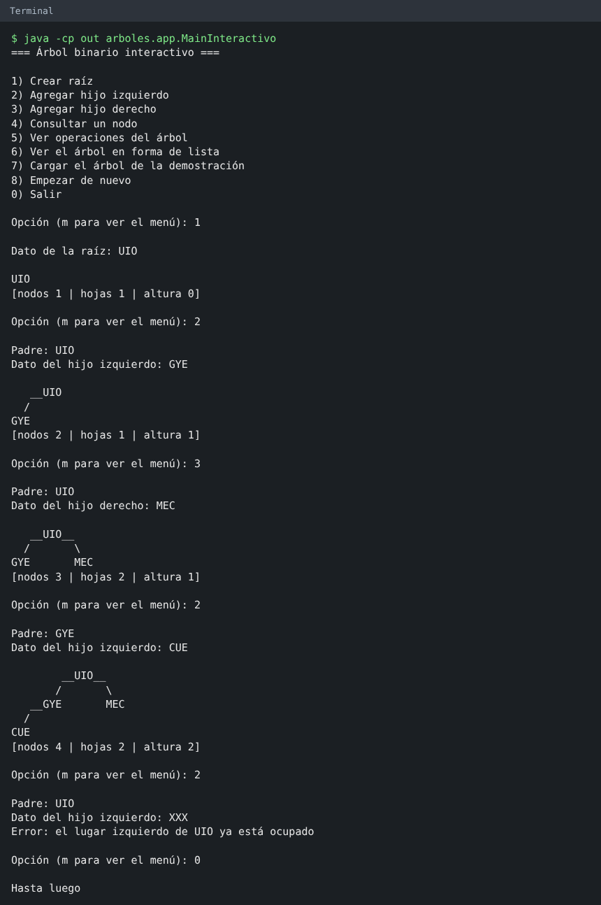

# Árboles binarios: Grupo 1

Microclase "Introducción a los árboles" de Estructura de Datos (Unidad 3), Universidad Técnica de Ambato, Facultad de Ingeniería en Sistemas, Electrónica e Industrial (FISEI), Nivel III, Paralelo B.

Fecha de la exposición: jueves 8 de octubre de 2026. Duración: 2 horas.

El repositorio reúne el código base en Java organizado por capas (modelo, negocio, app), el reto práctico para el curso, las pruebas automatizadas, los diagramas, la presentación, el quiz y las evidencias completas de la clase.

---

## 👥 Equipo

| Integrante | Usuario GitHub | Responsabilidad | Entrega en el repositorio | Estado |
|---|---|---|---|:---:|
| Chico Yunda Juan Carlos (líder) | [juanchicoyunda1234](https://github.com/juanchicoyunda1234) | Liderazgo, integración final, diagramas y README | `README.md`, `.gitignore`, `docs/DIAGRAMA-CLASES.md`, `docs/DIAGRAMA-SECUENCIA.md`, `docs/DIAGRAMAS-FLUJO.md` | **Completo** |
| Torosina Armendariz Jeremy | [WinoSpop](https://github.com/WinoSpop) | Pruebas e informe de ejecución | `src/reto/pruebas/PruebasArbol.java`, `src/reto/solucion/MainRetoSolucion.java`, `docs/CASOS-DE-PRUEBA.md` | **Completo** |
| Altamirano Segovia Jullisa | [jullisaaltamirano2017-boop](https://github.com/jullisaaltamirano2017-boop) | Presentación, quiz interactivo y material usado | `presentacion/` (PPTX y PDF), `docs/MATERIAL-USADO.md` | **Completo** |
| Romo Nunez Joseph | [wayusa25-cmyk](https://github.com/wayusa25-cmyk) | Backend: modelo y reto | `src/arboles/modelo/Nodo.java`, `src/reto/RETO.md` | **Completo** |
| Llamuca Abrajan Andres | [llamucaandres161](https://github.com/llamucaandres161) | Backend: negocio y banco de preguntas | `src/arboles/negocio/ArbolBinario.java`, `docs/QUIZ.md` | **Completo** |
| Tuza Quinatoa Noemi | [edithtuza15-collab](https://github.com/edithtuza15-collab) | Frontend: integración y consola | `src/arboles/app/Main.java`, `src/arboles/app/VistaArbol.java`, `src/arboles/app/ConsolaArbol.java`, `src/arboles/app/MainInteractivo.java`, `src/reto/MainReto.java`, `src/reto/MainRetoInteractivo.java`, `docs/img/` | **Completo** |

---

## 🔗 Enlaces

Todos los recursos usados en la clase están reunidos en [`docs/MATERIAL-USADO.md`](docs/MATERIAL-USADO.md).

| Recurso | Enlace |
|---|---|
| 🎨 Diapositivas (Canva) | [Abrir presentación en Canva](https://www.canva.com/design/DAHXRRsy3dU/xA8SoQxTXWldkgG0fct09w/edit) |
| 🧠 Quiz interactivo (Quizizz / Wayground) | [Abrir cuestionario en vivo](https://wayground.com/admin/quiz/6ac5b513346b0a5f373a4a08?source=quiz_share) |
| 🔍 Visualización de árboles (VisuAlgo) | [visualgo.net/en/bst](https://visualgo.net/en/bst) |
| 💻 Repositorio del proyecto | [GitHub: juanchicoyunda1234/Arboles_T](https://github.com/juanchicoyunda1234/Arboles_T.git) |

---

## 📅 Planificación de la clase

**Tema:** Introducción a los árboles (Unidad 3, Estructura de Datos)  
**Grupo:** Grupo 1 · Jueves 8 de octubre de 2026 · Duración: 2 horas  
**Objetivo:** Que el curso entienda qué es un árbol, cómo se construye en Java y cuándo conviene usarlo, y que lo practique con un reto propio.



### Fases de la Sesión

1. **Activación (0 a 5 min):**  
   Pregunta gancho sobre dónde hay árboles en la vida diaria (sistemas de archivos, organigramas, DOM) y su relación con el proyecto **SmartETL_DS** y los volúmenes de datos.

2. **Explicación visual (5 a 35 min):**  
   - **Diapositivas:** a cargo de todo el equipo: definición, terminología clave (raíz, nodos, hojas, nivel, altura), árbol general frente a árbol binario y el árbol en el proyecto final. [Canva](https://www.canva.com/design/DAHXRRsy3dU/xA8SoQxTXWldkgG0fct09w/edit).
   - **Dinámica "Árbol humano":** Seis voluntarios llevan tarjetas con códigos de aeropuertos (`UIO`, `GYE`, `MEC`, `CUE`, `LOH`, `ESM`) y forman el árbol binario. Con la mano izquierda y derecha señalan a sus respectivos hijos; quien no tiene hijo en un lado muestra una tarjeta `null`. La clase identifica la raíz, las hojas, el grado de `GYE` y la altura del árbol. Posteriormente se reacomodan en fila para visualizar el árbol degenerado en cadena.
   - **Demostración en VisuAlgo:** Comparación visual interactiva entre un árbol equilibrado y una cadena degenerada (<https://visualgo.net/en/bst>).

3. **Demostración Java (35 a 65 min):**  
   Código en vivo de las clases `Nodo` y `ArbolBinario` siguiendo la arquitectura por capas (modelo, negocio, app). Cada operación cuenta con su diagrama de flujo, complementada con la ejecución de `Main` que dibuja el árbol paso a paso en consola, en forma de lista y en forma gráfica. Después se usa `MainInteractivo`, un menú donde el curso dicta los datos y el árbol se dibuja con cada cambio.
   - Código: [`src/arboles/`](src/arboles/) | Diagramas: [`docs/`](docs/)

4. **Reto práctico (65 a 95 min):**  
   **"¿Árbol sano o árbol en cadena?"**: Los estudiantes construyen dos árboles binarios simples a partir de datos de aeropuertos, consultan nodos, hojas y altura, y programan el método `esCadena` para decidir si el árbol se degeneró en una lista. Solo usan las operaciones provistas sin estructuras auxiliares basadas en árboles de `java.util`. Pueden apoyarse en `MainRetoInteractivo` para cargar los árboles, dibujarlos y comprobar `esCadena`.
   - Enunciado: [`src/reto/RETO.md`](src/reto/RETO.md) | Plantilla: [`src/reto/MainReto.java`](src/reto/MainReto.java)

5. **Evaluación interactiva (95 a 110 min):**  
   Quiz formativo en línea de 10 preguntas sobre terminología, cálculo de altura y hojas, invariantes de capas y diferencia de desempeño entre un árbol sano y una cadena.
   - Quiz en vivo: [Quizizz / Wayground](https://wayground.com/admin/quiz/6ac5b513346b0a5f373a4a08?source=quiz_share) | Banco de preguntas: [`docs/QUIZ.md`](docs/QUIZ.md)

6. **Cierre (110 a 120 min):**  
   Resumen de conceptos consolidados, conexión con el Hito 4A (árboles binarios de búsqueda equilibrados para SmartETL_DS) y revisión de evidencias.

---

## 📂 Estructura del repositorio

El código está dividido en dos paquetes principales: `arboles`, que contiene la implementación explicada en la clase, y `reto`, que contiene el desafío práctico para los estudiantes.

```
README.md
.gitignore
src/
  arboles/                       Lo que se explica en la clase
    modelo/     Nodo.java        Capa de datos (referencias y grado)
    negocio/    ArbolBinario.java Lógica de negocio (conteo y altura)
    app/        Main.java, MainInteractivo.java, ConsolaArbol.java, VistaArbol.java
                                     Consola, menú interactivo y dibujo ASCII (lista y gráfico)
  reto/                          Lo que se usa en el reto práctico
    MainReto.java                Plantilla de trabajo para el estudiante
    MainRetoInteractivo.java     Menú de apoyo: cargar A o B, construir y probar esCadena
    RETO.md                      Enunciado detallado del reto
    solucion/   MainRetoSolucion.java Solución de referencia
    pruebas/    PruebasArbol.java Suite de pruebas automáticas (79 pruebas)
docs/
  DIAGRAMA-CLASES.md             Diagrama UML de clases por capas y paquetes
  DIAGRAMA-SECUENCIA.md          Diagramas de secuencia de las operaciones
  DIAGRAMAS-FLUJO.md             Diagramas de flujo de cada método
  CASOS-DE-PRUEBA.md             79 casos de prueba documentados con matriz
  QUIZ.md                        Banco de preguntas del quiz interactivo
  MATERIAL-USADO.md              Compendio de todos los recursos usados
  img/
    Planificacion_Semana9_Arboles_Grupo1.png    Infografía de planificación
    salida-main.png              Captura de ejecución de Main
    salida-interactivo.png       Captura de una sesión de MainInteractivo
    ejecucion-pruebas.png        Captura de ejecución de PruebasArbol (79/79)
presentacion/
  Introduccion_a_los_arboles_Grupo_1.pptx Presentación editable
  Introduccion_a_los_arboles_Grupo_1.pdf  Presentación en formato PDF
```

---

## 🏛️ Arquitectura por capas

Dentro del paquete `arboles` se aplica el patrón por capas para una separación clara de responsabilidades.

| Capa | Paquete | Clases | Responsabilidad |
|---|---|---|---|
| Modelo | `arboles.modelo` | `Nodo<T>` | Almacenar el dato y las referencias a sus hijos izquierdo y derecho |
| Negocio | `arboles.negocio` | `ArbolBinario<T>` | Construir el árbol y calcular nodos, hojas y altura |
| App | `arboles.app` | `Main`, `MainInteractivo`, `ConsolaArbol`, `VistaArbol` | Demostración, menú interactivo y dibujo del árbol en consola (lista y gráfico) |

El paquete `reto` consume el paquete `arboles` como una librería externa, sin modificar su código.

| Paquete | Clases | Responsabilidad |
|---|---|---|
| `reto` | `MainReto`, `MainRetoInteractivo` | Plantilla donde los estudiantes resuelven el reto y menú de apoyo para probarlo |
| `reto.solucion` | `MainRetoSolucion` | Solución del reto con construcción y algoritmo `esCadena` |
| `reto.pruebas` | `PruebasArbol` | Batería de 79 pruebas automáticas para árbol y reto |

---

## 🚀 Compilar y ejecutar

### Código de la clase (Demostración)

```bash
javac -encoding UTF-8 -d out src/arboles/modelo/*.java src/arboles/negocio/*.java src/arboles/app/*.java
java -cp out arboles.app.Main
java -cp out arboles.app.MainInteractivo
```

En Windows, si los acentos se ven con símbolos extraños, ejecutar antes `chcp 65001` en la consola.

### Reto, solución y pruebas (Compilación total)

```bash
javac -encoding UTF-8 -d out src/arboles/modelo/*.java src/arboles/negocio/*.java src/arboles/app/*.java src/reto/*.java src/reto/solucion/*.java src/reto/pruebas/*.java
java -cp out reto.pruebas.PruebasArbol
java -cp out reto.solucion.MainRetoSolucion
java -cp out reto.MainReto
java -cp out reto.MainRetoInteractivo
```

---

## 🖥️ Salida de la demostración en consola



`VistaArbol` genera un dibujo jerárquico claro en formato ASCII compatible con cualquier consola:

```
UIO
+-- I: GYE
|   +-- I: CUE
|   `-- D: LOH
`-- D: MEC
    `-- D: ESM
```

`VistaArbol.mostrarGrafico` dibuja el mismo árbol en forma gráfica, con las ramas `/` y `\`:

```
        _______UIO__
       /            \
   __GYE__          MEC__
  /       \              \
CUE       LOH            ESM
```

### Menú interactivo

`MainInteractivo` permite construir el árbol escribiendo los datos. Después de cada cambio dibuja el árbol en forma gráfica y muestra la cantidad de nodos, hojas y la altura. Los errores se muestran y el programa sigue.



---

## 📐 Operaciones del Árbol

| Clase | Operación | Tipo | Descripción |
|---|---|---|---|
| `Nodo<T>` | `getDato`, `setDato` | Consulta/Modificación | Obtiene o modifica el valor del nodo |
| `Nodo<T>` | `getIzquierdo`, `setIzquierdo` | Punteros | Referencia al hijo izquierdo |
| `Nodo<T>` | `getDerecho`, `setDerecho` | Punteros | Referencia al hijo derecho |
| `Nodo<T>` | `esHoja` | Consulta | Determina si no posee hijos (`grado() == 0`) |
| `Nodo<T>` | `grado` | Consulta | Retorna 0, 1 o 2 según la cantidad de hijos activos |
| `ArbolBinario<T>` | `esVacio` | Estado | `true` si la raíz es `null` |
| `ArbolBinario<T>` | `crearRaiz` | Construcción | Inicializa la raíz (lanza excepción si ya existe) |
| `ArbolBinario<T>` | `agregarIzquierdo` | Construcción | Conecta un hijo izquierdo al padre indicado |
| `ArbolBinario<T>` | `agregarDerecho` | Construcción | Conecta un hijo derecho al padre indicado |
| `ArbolBinario<T>` | `contarNodos` | Recorrido recursivo | Total de nodos presentes en la estructura |
| `ArbolBinario<T>` | `contarHojas` | Recorrido recursivo | Total de nodos terminales sin hijos |
| `ArbolBinario<T>` | `altura` | Recorrido recursivo | Longitud del camino más largo en aristas (-1 si vacío, 0 si un nodo) |
| `VistaArbol` | `mostrar` | Dibujo | Dibuja el árbol en forma de lista con ramas `I` y `D` |
| `VistaArbol` | `mostrarGrafico` | Dibujo | Dibuja el árbol en forma gráfica con ramas `/` y `\` |

---

## 🎯 Reto práctico: "¿Árbol sano o árbol en cadena?"

Los estudiantes construyen dos árboles con las operaciones dadas, consultan raíz, nodos, hojas y altura, y escriben el método:

```java
public static <T> boolean esCadena(ArbolBinario<T> arbol) {
    if (arbol.esVacio()) return false;
    return arbol.altura() == arbol.contarNodos() - 1;
}
```

No se permite el uso de clases de `java.util` basadas en árboles (`TreeSet`, `TreeMap`, etc.). El enunciado completo se encuentra en [`src/reto/RETO.md`](src/reto/RETO.md) y la solución en [`src/reto/solucion/MainRetoSolucion.java`](src/reto/solucion/MainRetoSolucion.java).

---

## 📊 Documentación técnica

| Documento | Contenido |
|---|---|
| [`docs/DIAGRAMA-CLASES.md`](docs/DIAGRAMA-CLASES.md) | Diagrama de clases UML con vistas general, por capas y de paquetes |
| [`docs/DIAGRAMA-SECUENCIA.md`](docs/DIAGRAMA-SECUENCIA.md) | Diagramas de secuencia de construcción, recursión de altura y `esCadena` |
| [`docs/DIAGRAMAS-FLUJO.md`](docs/DIAGRAMAS-FLUJO.md) | Diagrama de flujo detallado para cada método del modelo y negocio |
| [`docs/CASOS-DE-PRUEBA.md`](docs/CASOS-DE-PRUEBA.md) | Matriz con los 79 casos de prueba ejecutados y su resultado |
| [`docs/QUIZ.md`](docs/QUIZ.md) | Banco de 10 preguntas del quiz con respuestas y explicaciones |
| [`docs/MATERIAL-USADO.md`](docs/MATERIAL-USADO.md) | Enlaces e inventario de recursos utilizados en la sesión |

---

## 🌐 Conexión con el proyecto integrador (SmartETL_DS)

En **SmartETL_DS** cada integrante procesa grandes volúmenes de datos. Por ejemplo, en el conjunto de aeropuertos de Juan Carlos (7.698 registros):

- **Búsqueda lineal en lista:** En el peor caso requiere hasta 7.698 comparaciones ($O(N)$).
- **Búsqueda en árbol binario equilibrado:** Requiere a lo sumo $\lceil \log_2(7.698) \rceil = 13$ comparaciones ($O(\log N)$).
- **Árbol degenerado en cadena:** Si los datos se insertan ordenados sin balancear, la altura es igual a $N-1$ y el rendimiento se degrada nuevamente a $O(N)$.

Este reto introduce directamente los fundamentos del **Hito 4A (Árbol Binario de Búsqueda)**.

---

## 📦 Evidencias entregadas

1. **Presentación de la clase:** Diapositivas en formato editable [`presentacion/Introduccion_a_los_arboles_Grupo_1.pptx`](presentacion/Introduccion_a_los_arboles_Grupo_1.pptx) y exportado [`presentacion/Introduccion_a_los_arboles_Grupo_1.pdf`](presentacion/Introduccion_a_los_arboles_Grupo_1.pdf).
2. **Código base completo:** Estructura modular en [`src/`](src/) bajo patrón por capas.
3. **Ejercicio práctico contextualizado:** Reto resuelto y plantilla en [`src/reto/`](src/reto/).
4. **Casos de prueba automatizados:** 79 pruebas unitarias pasando al 100% en [`docs/CASOS-DE-PRUEBA.md`](docs/CASOS-DE-PRUEBA.md).
5. **Diagramas técnicos:** Diagramas Mermaid de clases, secuencia y flujos en [`docs/`](docs/).
6. **Quiz interactivo:** Cuestionario activo en Quizizz y banco respaldado en [`docs/QUIZ.md`](docs/QUIZ.md).
7. **Planificación y material:** Respaldo completo de la clase y recursos en [`docs/MATERIAL-USADO.md`](docs/MATERIAL-USADO.md).
