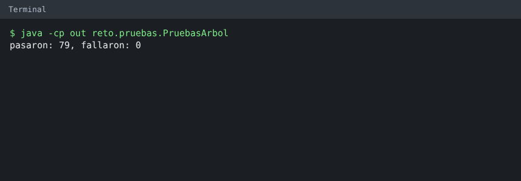

# Casos de Prueba y Evidencia de Ejecución

**Materia:** Estructura de Datos (Unidad 3) · UTA FISEI  
**Tema:** Introducción a los Árboles · Grupo 1  
**Responsable:** Torosina Armendariz Jeremy (`WinoSpop`)  
**Suite de pruebas:** `src/reto/pruebas/PruebasArbol.java`  
**Resultado:** **79 pasaron, 0 fallaron (100% de éxito)**

---

## 📸 Evidencia de Ejecución en Consola



```
$ java -cp out reto.pruebas.PruebasArbol
pasaron: 79, fallaron: 0
```

---

## 📋 Resumen por Módulo

| Módulo de Prueba | Descripción | Cantidad de Casos | Exitosos | Fallidos |
|---|---|:---:|:---:|:---:|
| **1. Nodo** | Creación, datos, enlaces, hojas y cálculo de grado (0, 1 y 2) | 10 | 10 | 0 |
| **2. Árbol Vacío** | Estado inicial, referencias nulas, conteo y altura (-1) | 5 | 5 | 0 |
| **3. Árbol de Un Solo Nodo** | Raíz única, no vacío, conteos base y altura (0) | 6 | 6 | 0 |
| **4. Árbol de Demostración** | Árbol completo con 6 nodos, 3 hojas y altura 2 | 6 | 6 | 0 |
| **5. Manejo de Errores** | Excepciones al violar invariantes y validación de mensajes | 7 | 7 | 0 |
| **6. Vista en Consola** | Renderizado ASCII de árbol demo, vacío y asimétrico | 3 | 3 | 0 |
| **7. Reto Práctico** | Árbol sano (A), árbol en cadena (B) y algoritmo `esCadena` | 14 | 14 | 0 |
| **8. Dibujo Gráfico** | Dibujo con ramas `/` y `\` del árbol demo, vacío, de un nodo y de la cadena B | 5 | 5 | 0 |
| **9. Menú de Consola** | Entradas simuladas, búsqueda por dato y errores controlados del menú interactivo | 23 | 23 | 0 |
| **TOTAL** | **Validación integral del sistema** | **79** | **79** | **0** |

---

## 🧪 Detalle de los 79 Casos de Prueba

### 1. Pruebas de la Clase Nodo (`pruebasNodo`)

| # | Caso de Prueba | Entrada / Precondición | Resultado Esperado | Resultado Obtenido | Estado |
|:---:|---|---|---|---|:---:|
| 1 | `nodo nuevo es hoja` | `new Nodo<>("A")` | `esHoja() == true` | `true` | ✅ PASÓ |
| 2 | `nodo nuevo grado 0` | Nodo recién instanciado sin hijos | `grado() == 0` | `0` | ✅ PASÓ |
| 3 | `dato` | Inicialización con "A" | `getDato().equals("A")` | `"A"` | ✅ PASÓ |
| 4 | `setDato` | Modificación de dato a "Z" | `getDato().equals("Z")` | `"Z"` | ✅ PASÓ |
| 5 | `con hijo izquierdo no es hoja` | `setIzquierdo(new Nodo<>("B"))` | `!esHoja() == true` | `false` | ✅ PASÓ |
| 6 | `grado 1 solo izquierdo` | Nodo solo con hijo izquierdo | `grado() == 1` | `1` | ✅ PASÓ |
| 7 | `grado 2` | Nodo con hijo izquierdo y derecho | `grado() == 2` | `2` | ✅ PASÓ |
| 8 | `getIzquierdo` | Obtener referencia izquierda | Dato `"B"` | `"B"` | ✅ PASÓ |
| 9 | `getDerecho` | Obtener referencia derecha | Dato `"C"` | `"C"` | ✅ PASÓ |
| 10 | `grado 1 solo derecho` | Nodo solo con hijo derecho | `grado() == 1` | `1` | ✅ PASÓ |

### 2. Pruebas de Árbol Vacío (`pruebasArbolVacio`)

| # | Caso de Prueba | Entrada / Precondición | Resultado Esperado | Resultado Obtenido | Estado |
|:---:|---|---|---|---|:---:|
| 11 | `vacío esVacio` | `new ArbolBinario<>()` | `esVacio() == true` | `true` | ✅ PASÓ |
| 12 | `vacío raíz null` | Árbol sin inicializar raíz | `getRaiz() == null` | `null` | ✅ PASÓ |
| 13 | `vacío contarNodos 0` | Árbol vacío | `contarNodos() == 0` | `0` | ✅ PASÓ |
| 14 | `vacío contarHojas 0` | Árbol vacío | `contarHojas() == 0` | `0` | ✅ PASÓ |
| 15 | `vacío altura -1` | Árbol vacío (definición por aristas) | `altura() == -1` | `-1` | ✅ PASÓ |

### 3. Pruebas de Árbol de Un Solo Nodo (`pruebasArbolUnNodo`)

| # | Caso de Prueba | Entrada / Precondición | Resultado Esperado | Resultado Obtenido | Estado |
|:---:|---|---|---|---|:---:|
| 16 | `crearRaiz devuelve la raíz` | `crearRaiz("UIO")` | Devuelve referencia igual a `getRaiz()` | Coincide | ✅ PASÓ |
| 17 | `un nodo no vacío` | Árbol con raíz | `!esVacio() == true` | `false` (no vacío) | ✅ PASÓ |
| 18 | `un nodo contarNodos 1` | Árbol con raíz | `contarNodos() == 1` | `1` | ✅ PASÓ |
| 19 | `un nodo contarHojas 1` | Raíz sin hijos | `contarHojas() == 1` | `1` | ✅ PASÓ |
| 20 | `un nodo altura 0` | Raíz única (0 aristas) | `altura() == 0` | `0` | ✅ PASÓ |
| 21 | `raíz es hoja` | Raíz sin descendientes | `r.esHoja() == true` | `true` | ✅ PASÓ |

### 4. Pruebas de Árbol de Demostración (`pruebasArbolDemo`)

Estructura: Raíz UIO, hijos GYE (izq) y MEC (der); GYE tiene CUE (izq) y LOH (der); MEC tiene ESM (der).

| # | Caso de Prueba | Entrada / Precondición | Resultado Esperado | Resultado Obtenido | Estado |
|:---:|---|---|---|---|:---:|
| 22 | `demo contarNodos 6` | Árbol con 6 aeropuertos | `contarNodos() == 6` | `6` | ✅ PASÓ |
| 23 | `demo contarHojas 3` | Hojas: CUE, LOH, ESM | `contarHojas() == 3` | `3` | ✅ PASÓ |
| 24 | `demo altura 2` | Camino más largo UIO → GYE → CUE | `altura() == 2` | `2` | ✅ PASÓ |
| 25 | `demo grado raíz 2` | UIO tiene 2 hijos | `grado() == 2` | `2` | ✅ PASÓ |
| 26 | `demo MEC grado 1` | MEC solo tiene hijo derecho ESM | `grado() == 1` | `1` | ✅ PASÓ |
| 27 | `demo GYE no es hoja` | GYE tiene descendientes | `!esHoja() == true` | `false` | ✅ PASÓ |

### 5. Pruebas de Manejo de Errores y Validaciones (`pruebasErrores`)

| # | Caso de Prueba | Entrada / Precondición | Resultado Esperado | Resultado Obtenido | Estado |
|:---:|---|---|---|---|:---:|
| 28 | `crearRaiz dos veces` | Invocar `crearRaiz` cuando ya existe raíz | `IllegalStateException` | Excepción capturada | ✅ PASÓ |
| 29 | `izquierdo ocupado` | `agregarIzquierdo` en padre con hijo izq | `IllegalStateException` | Excepción capturada | ✅ PASÓ |
| 30 | `derecho ocupado` | `agregarDerecho` en padre con hijo der | `IllegalStateException` | Excepción capturada | ✅ PASÓ |
| 31 | `padre null izquierdo` | `agregarIzquierdo(null, "X")` | `IllegalArgumentException` | Excepción capturada | ✅ PASÓ |
| 32 | `padre null derecho` | `agregarDerecho(null, "X")` | `IllegalArgumentException` | Excepción capturada | ✅ PASÓ |
| 33 | `el error no cambia el árbol` | Operaciones fallidas previas | Conteo intacto (`contarNodos() == 3`) | `3` | ✅ PASÓ |
| 34 | `mensaje del error` | Intento de sobreescribir hijo izquierdo | `"el lugar izquierdo de UIO ya está ocupado"` | Mensaje exacto | ✅ PASÓ |

### 6. Pruebas de la Vista en Consola (`pruebasVista`)

| # | Caso de Prueba | Entrada / Precondición | Resultado Esperado | Resultado Obtenido | Estado |
|:---:|---|---|---|---|:---:|
| 35 | `vista del árbol demo` | Árbol demo de 6 nodos | Salida ASCII con ramas jerárquicas exactas | Coincide 100% | ✅ PASÓ |
| 36 | `vista del árbol vacío` | Árbol sin nodos | Salida `"(árbol vacío)\n"` | Coincide 100% | ✅ PASÓ |
| 37 | `vista con solo hijo derecho` | Árbol `A -> D: B` | Salida `"A\n`-- D: B\n"` | Coincide 100% | ✅ PASÓ |

### 7. Pruebas del Reto Práctico (`pruebasReto`)

Validación de Árbol A (sano/equilibrado) y Árbol B (degenerado en cadena).

| # | Caso de Prueba | Entrada / Precondición | Resultado Esperado | Resultado Obtenido | Estado |
|:---:|---|---|---|---|:---:|
| 38 | `A nodos 8` | Árbol A construido | `contarNodos() == 8` | `8` | ✅ PASÓ |
| 39 | `A hojas 4` | Hojas de A (TUA, IBB, LGQ, OCC) | `contarHojas() == 4` | `4` | ✅ PASÓ |
| 40 | `A altura 3` | Camino LTX → MCH → SNC → LGQ | `altura() == 3` | `3` | ✅ PASÓ |
| 41 | `A grado LTX 2` | Raíz de A | `grado() == 2` | `2` | ✅ PASÓ |
| 42 | `A grado SNC 1` | Nodo SNC | `grado() == 1` | `1` | ✅ PASÓ |
| 43 | `A no es cadena` | Evaluación con `esCadena(a)` | `false` | `false` | ✅ PASÓ |
| 44 | `vista de A` | Renderizado ASCII de A | Formato jerárquico esperado | Coincide 100% | ✅ PASÓ |
| 45 | `B nodos 5` | Árbol B construido (GPS a TPN) | `contarNodos() == 5` | `5` | ✅ PASÓ |
| 46 | `B hojas 1` | Solo TPN es hoja | `contarHojas() == 1` | `1` | ✅ PASÓ |
| 47 | `B altura 4` | Camino lineal de 4 aristas | `altura() == 4` | `4` | ✅ PASÓ |
| 48 | `B es cadena` | Evaluación con `esCadena(b)` | `true` | `true` | ✅ PASÓ |
| 49 | `vista de B` | Renderizado ASCII de B | Lista vertical escalonada hacia la derecha | Coincide 100% | ✅ PASÓ |
| 50 | `vacío no es cadena` | Árbol sin nodos | `esCadena(vacio) == false` | `false` | ✅ PASÓ |
| 51 | `un nodo es cadena` | Árbol con solo raíz UIO | `esCadena(uno) == true` | `true` | ✅ PASÓ |

### 8. Pruebas del Dibujo Gráfico (`pruebasGrafico`)

| # | Caso de Prueba | Entrada / Precondición | Resultado Esperado | Resultado Obtenido | Estado |
|:---:|---|---|---|---|:---:|
| 52 | `gráfico del árbol demo` | Árbol demo de 6 nodos | Dibujo de 5 filas con ramas `/` y `\` | Coincide 100% | ✅ PASÓ |
| 53 | `gráfico del árbol vacío` | Árbol sin nodos | `(árbol vacío)` | Coincide 100% | ✅ PASÓ |
| 54 | `gráfico de un solo nodo` | Árbol con solo la raíz UIO | `UIO` | Coincide 100% | ✅ PASÓ |
| 55 | `gráfico de la cadena B` | Árbol B (5 nodos, solo hijos derechos) | Escalera hacia la derecha con `\` | Coincide 100% | ✅ PASÓ |
| 56 | `el gráfico tiene una fila por cada nodo de la cadena` | Árbol B | 9 filas (2 por nivel menos 1) | 9 filas | ✅ PASÓ |

### 9. Pruebas del Menú de Consola (`pruebasConsola`)

Se simula lo que escribe el usuario con un `Scanner` sobre un texto fijo y se captura lo que imprime el programa.

| # | Caso de Prueba | Entrada / Precondición | Resultado Esperado | Resultado Obtenido | Estado |
|:---:|---|---|---|---|:---:|
| 57 | `arbolDemo 6 nodos` | `ConsolaArbol.arbolDemo()` | `contarNodos() == 6` | `6` | ✅ PASÓ |
| 58 | `arbolDemo altura 2` | `ConsolaArbol.arbolDemo()` | `altura() == 2` | `2` | ✅ PASÓ |
| 59 | `buscar encuentra LOH` | `buscar(raíz, "LOH")` | Nodo distinto de `null` | Encontrado | ✅ PASÓ |
| 60 | `buscar no encuentra XYZ` | `buscar(raíz, "XYZ")` | `null` | `null` | ✅ PASÓ |
| 61 | `buscar en árbol vacío` | `buscar(null, "A")` | `null` | `null` | ✅ PASÓ |
| 62 | `agregar sin raíz avisa` | Entrada `UIO` y `GYE` con árbol vacío | `Error: primero hay que crear la raíz` | Mensaje exacto | ✅ PASÓ |
| 63 | `agregar sin raíz no crea nodos` | Mismo caso | `contarNodos() == 0` | `0` | ✅ PASÓ |
| 64 | `crearRaiz desde consola` | Entrada `UIO` | Raíz con dato `UIO` | `UIO` | ✅ PASÓ |
| 65 | `crearRaiz muestra el estado` | Entrada `UIO` | `[nodos 1 | hojas 1 | altura 0]` | Coincide | ✅ PASÓ |
| 66 | `raíz repetida avisa` | Entrada `OTRA` con raíz existente | `Error: el árbol ya tiene raíz` | Mensaje exacto | ✅ PASÓ |
| 67 | `raíz repetida no cambia el árbol` | Mismo caso | La raíz sigue siendo `UIO` | `UIO` | ✅ PASÓ |
| 68 | `dato vacío avisa` | Línea vacía como raíz | `Error: el dato no puede estar vacío` | Mensaje exacto | ✅ PASÓ |
| 69 | `agregar izquierdo desde consola` | Padre `UIO`, dato `GYE` | Hijo izquierdo `GYE` | `GYE` | ✅ PASÓ |
| 70 | `agregar derecho desde consola` | Padre `UIO`, dato `MEC` | Hijo derecho `MEC` | `MEC` | ✅ PASÓ |
| 71 | `lugar ocupado avisa` | Padre `UIO`, dato `XXX`, lado izquierdo | `Error: el lugar izquierdo de UIO ya está ocupado` | Mensaje exacto | ✅ PASÓ |
| 72 | `lugar ocupado no cambia el árbol` | Mismo caso | `contarNodos() == 3` | `3` | ✅ PASÓ |
| 73 | `padre inexistente avisa` | Padre `ZZZ` | `no existe un nodo con el dato 'ZZZ'` | Mensaje exacto | ✅ PASÓ |
| 74 | `padre inexistente no cambia el árbol` | Mismo caso | `contarNodos() == 3` | `3` | ✅ PASÓ |
| 75 | `hijo vacío avisa` | Padre `GYE`, dato vacío | `Error: el dato no puede estar vacío` | Mensaje exacto | ✅ PASÓ |
| 76 | `hijo vacío no cambia el árbol` | Mismo caso | `contarNodos() == 3` | `3` | ✅ PASÓ |
| 77 | `consultar nodo muestra esHoja y grado` | Nodo `GYE` del árbol demo | `GYE -> esHoja: false, grado: 2` | Coincide | ✅ PASÓ |
| 78 | `consultar nodo muestra los hijos` | Nodo `GYE` del árbol demo | `izquierdo: CUE, derecho: LOH` | Coincide | ✅ PASÓ |
| 79 | `operaciones muestra nodos, hojas y altura` | Árbol demo | Nodos 6, hojas 3 y altura 2 | Coincide | ✅ PASÓ |

---

## ⚙️ Cómo Ejecutar las Pruebas

Para reproducir estas pruebas en cualquier entorno con Java instalado:

```bash
# Compilar todo el proyecto
javac -encoding UTF-8 -d out src/arboles/modelo/*.java src/arboles/negocio/*.java src/arboles/app/*.java src/reto/*.java src/reto/solucion/*.java src/reto/pruebas/*.java

# Ejecutar la suite de pruebas
java -cp out reto.pruebas.PruebasArbol
```
