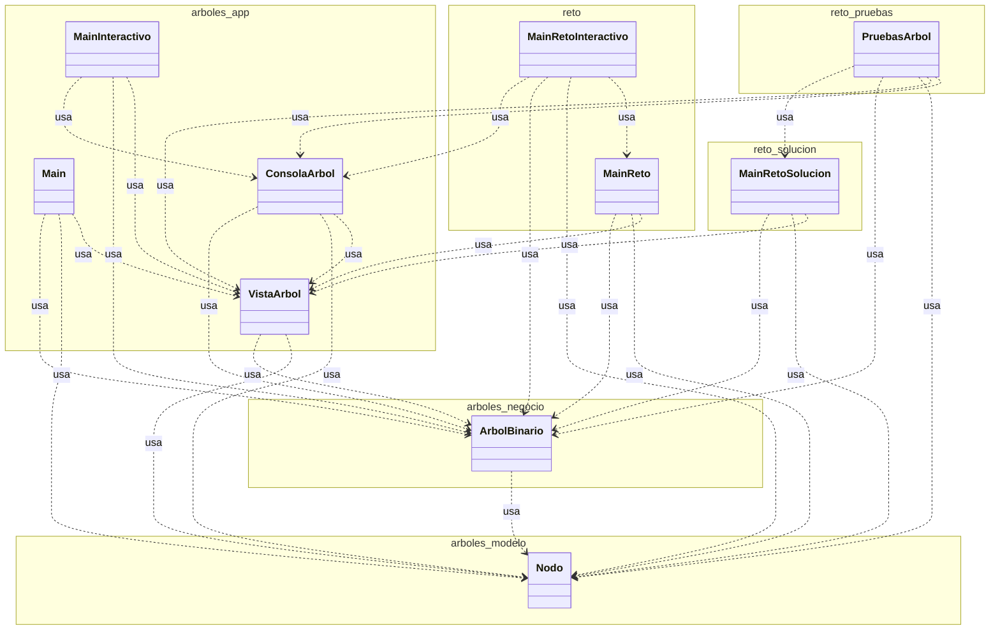
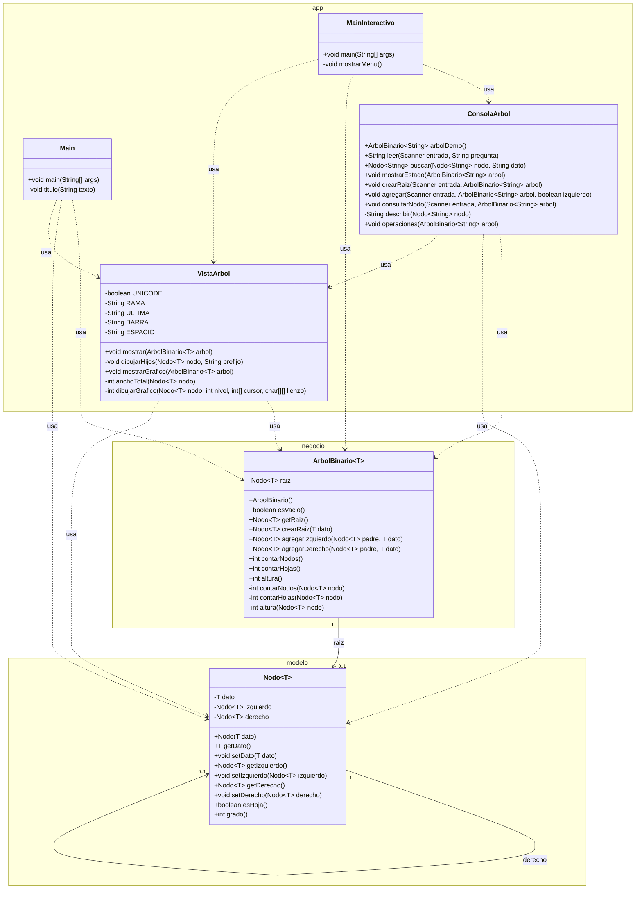
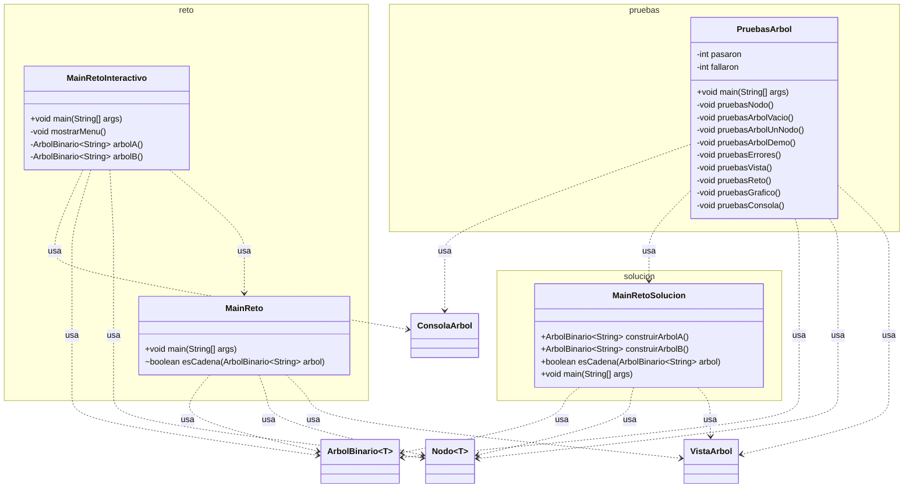

# Diagrama de clases

Un diagrama de clases muestra las clases del programa, sus atributos, sus métodos y cómo se relacionan. Este documento describe el código real de la microclase: el paquete `arboles`, organizado en las capas modelo, negocio y app, y el paquete `reto`, que usa esas clases sin modificarlas.

Los tres diagramas usan la sintaxis de Mermaid. GitHub los dibuja al abrir este archivo.

## Vista general de paquetes

Solo aparecen las clases y las flechas de uso. Los atributos y los métodos están en los diagramas de cada paquete.

`arboles_modelo` es el paquete `arboles.modelo`, `arboles_negocio` es `arboles.negocio` y `arboles_app` es `arboles.app`. `reto_solucion` es `reto.solucion` y `reto_pruebas` es `reto.pruebas`.

La flecha punteada significa que la clase de origen usa a la clase de destino. `ArbolBinario` usa a `Nodo`. `Main`, `MainInteractivo`, `ConsolaArbol` y `VistaArbol` usan a `ArbolBinario` y, en varios casos, a `Nodo`. `MainInteractivo` y `MainRetoInteractivo` delegan en `ConsolaArbol` la lectura por consola y las acciones del menú. Las clases del paquete `reto` usan el paquete `arboles` y no lo modifican. `PruebasArbol` además usa a `MainRetoSolucion` para comprobar el árbol A, el árbol B y `esCadena`, y a `ConsolaArbol` para probar el menú con entradas simuladas. `MainReto` importa `VistaArbol` para que el estudiante pueda dibujar su árbol, aunque la plantilla todavía no lo llama.

## Paquete arboles

Clases de la clase, con atributos, métodos y visibilidad. `+` es público y `-` es privado. `Nodo~T~` y `ArbolBinario~T~` son las clases genéricas `Nodo<T>` y `ArbolBinario<T>`.

La capa modelo es `Nodo`. Guarda un dato y dos referencias, `izquierdo` y `derecho`, cada una con multiplicidad 0..1 porque un hijo puede no existir. La capa negocio es `ArbolBinario`. Tiene una raíz, también 0..1, y ofrece las operaciones de construcción y de consulta. `contarNodos`, `contarHojas` y `altura` tienen un método público sin parámetros y un método privado recursivo que recibe el nodo. La capa app tiene cuatro clases. `Main` arma el ejemplo UIO, GYE, MEC, CUE, LOH y ESM. `VistaArbol` lo dibuja en consola, en forma de lista (`mostrar`) y en forma gráfica (`mostrarGrafico`). `MainInteractivo` es un menú donde se construye el árbol escribiendo los datos, y `ConsolaArbol` reúne la lectura por consola y las acciones que comparte ese menú con el del reto.

`VistaArbol` no es genérica. El parámetro de tipo está en `mostrar`, `dibujarHijos`, `mostrarGrafico`, `anchoTotal` y `dibujarGrafico`. `ConsolaArbol` trabaja solo con árboles de `String`, porque lo que se escribe por consola es texto. `UNICODE` vale `false`, así que `RAMA`, `ULTIMA`, `BARRA` y `ESPACIO` quedan con el estilo ASCII (`+-- `, la última rama, `|   ` y cuatro espacios). `Main` y `VistaArbol` dependen de `ArbolBinario`. También usan `Nodo`, porque `Main` guarda los nodos que devuelven `crearRaiz` y `agregarIzquierdo`, y `VistaArbol` recorre los hijos.

## Paquete reto

Métodos principales de la plantilla, de la solución y de las pruebas, y su uso del paquete `arboles`.

`MainReto` es la plantilla. Crea el árbol A y el árbol B vacíos, y su `esCadena` devuelve `false`. El método no lleva `public`: en el diagrama el `~` indica visibilidad de paquete. `MainRetoSolucion` construye los dos árboles del enunciado y en `esCadena` devuelve `false` si el árbol está vacío. Si no, compara `altura()` con `contarNodos() - 1`. `MainRetoInteractivo` es la herramienta de apoyo del reto: carga el árbol A o el B, deja construir un árbol propio, dibuja cada cambio y, con la opción 9, muestra lo que devuelve el `esCadena` de `MainReto` junto con la altura y la cantidad de nodos. Mientras la plantilla no esté completa, esa opción devuelve `false`. `PruebasArbol` ejecuta nueve grupos de pruebas y cuenta cuántas pasan y cuántas fallan. Si falla alguna, `main` termina con código 1. Los métodos privados `verificar`, `lanza`, `capturar` y `arbolDemo` apoyan esas pruebas y no cambian el diseño de las clases.

## Responsabilidad de cada clase

| Clase | Paquete principal | Capa | Responsabilidad |
|---|---|---|---|
| `Nodo` | arboles | modelo | Guardar un dato y las referencias a su hijo izquierdo y a su hijo derecho |
| `ArbolBinario` | arboles | negocio | Construir el árbol y calcular la cantidad de nodos, la cantidad de hojas y la altura |
| `Main` | arboles | app | Demostrar las operaciones con códigos de aeropuerto y mostrar los errores controlados |
| `VistaArbol` | arboles | app | Dibujar el árbol en consola: en forma de lista, con `I` para el hijo izquierdo y `D` para el derecho, y en forma gráfica con ramas `/` y `\` |
| `MainInteractivo` | arboles | app | Menú por consola para construir y consultar un árbol escribiendo los datos, con el dibujo gráfico después de cada cambio |
| `ConsolaArbol` | arboles | app | Leer datos por consola, buscar un nodo por su dato y ejecutar las acciones del menú con sus errores controlados |
| `MainReto` | reto | no aplica | Plantilla del reto. El estudiante construye los árboles y completa `esCadena` |
| `MainRetoInteractivo` | reto | no aplica | Menú de apoyo del reto: cargar el árbol A o B, construir uno propio y probar `esCadena` |
| `MainRetoSolucion` | reto | no aplica | Solución del reto: arma el árbol A, arma el árbol B y decide si un árbol es una cadena |
| `PruebasArbol` | reto | no aplica | Comprobar el nodo, el árbol, los errores, los dos dibujos, la solución del reto y el menú de consola |

## Cómo leer el diagrama

El rectángulo es una clase. Si el nombre lleva `~T~`, la clase es genérica: el mismo código sirve para distintos tipos de dato. El signo `+` marca un miembro público y el signo `-` un miembro privado. La flecha continua, con multiplicidad `0..1`, es una referencia que puede no existir: un nodo hacia cada hijo, y el árbol hacia su raíz. La flecha punteada indica que una clase usa a otra, por ejemplo cuando `Main` llama a `ArbolBinario`. Conviene leer primero la vista de paquetes, después las tres capas de `arboles` y al final el paquete `reto`.

## Decisiones de diseño

Hay dos paquetes porque la clase explica `arboles` y el reto debe resolverse sin cambiarlo. `reto` solo crea árboles, consulta sus operaciones y decide si el resultado es una cadena.

Hay tres capas para separar responsabilidades. `arboles.modelo` guarda el nodo. `arboles.negocio` construye el árbol y calcula. `arboles.app` demuestra y dibuja en consola. Así la regla de negocio no depende de cómo se imprime el árbol.

El tipo `T` es genérico para no atar el árbol a `String`. En la demostración y en el reto el dato es un código de aeropuerto, y el mismo `Nodo` y el mismo `ArbolBinario` podrían guardar otro tipo.

La altura se cuenta en aristas. El método privado devuelve `-1` cuando el nodo es `null`. El árbol vacío mide `-1`. El árbol de un solo nodo mide `0`, porque `1 + max(-1, -1) = 0`.
