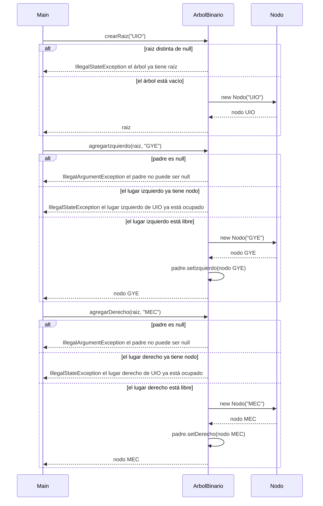
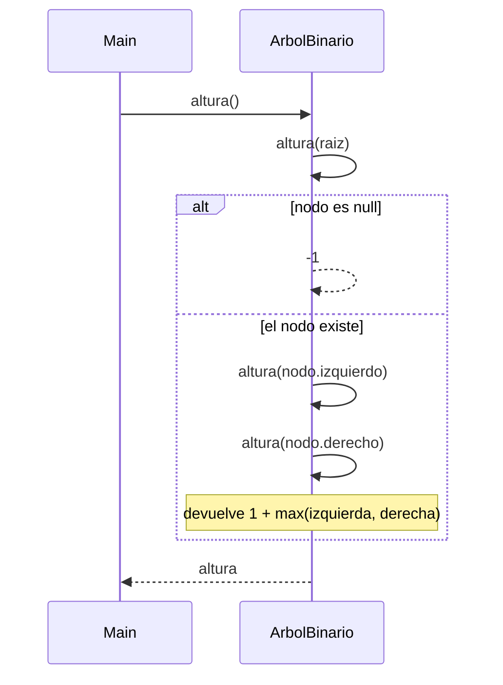
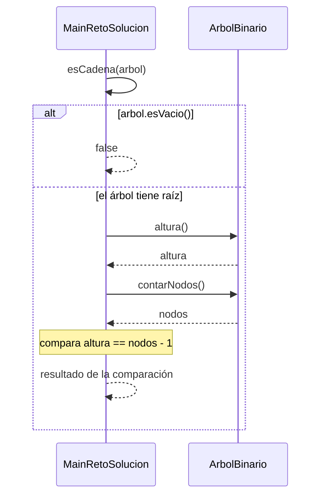

# Diagramas de secuencia

Un diagrama de secuencia muestra el orden de las llamadas entre objetos durante una operación. Cada diagrama de este documento sigue el código real: los mismos métodos, las mismas condiciones y los mismos mensajes de error.

La flecha continua es una llamada. La flecha punteada es una respuesta. El bloque `alt` separa el camino normal de los casos de error.

## Paquete arboles

### Construir el árbol desde Main

`Main` crea la raíz `UIO`, el hijo izquierdo `GYE` y el hijo derecho `MEC`. Es el inicio de la demostración de `arboles.app.Main`.

`crearRaiz` solo crea el nodo cuando `raiz` es `null`. Si el árbol ya tiene raíz, lanza `IllegalStateException` con el mensaje `el árbol ya tiene raíz` y no cambia el árbol. `agregarIzquierdo` y `agregarDerecho` revisan primero que el padre no sea `null`. En ese caso lanzan `IllegalArgumentException` con el mensaje `el padre no puede ser null`. Después revisan si ese lado ya tiene hijo. El mensaje es `el lugar izquierdo de UIO ya está ocupado` o `el lugar derecho de UIO ya está ocupado`, con el dato real del padre. Si el lugar está libre, crean un `Nodo` nuevo, lo enganchan con `setIzquierdo` o `setDerecho` y lo devuelven. En `Main`, el intento posterior de volver a agregar un izquierdo a `UIO` cae en ese `IllegalStateException` y el programa lo muestra sin detenerse.

### Calcular la altura

`altura()` público delega en el método privado recursivo. La altura se cuenta en aristas.

El método público no recorre el árbol: llama a `altura(raiz)` y devuelve ese resultado. Si el nodo recibido es `null`, el caso base devuelve `-1`. Si el nodo existe, el método se llama otra vez con el hijo izquierdo y con el hijo derecho, aunque uno de los dos sea `null`. La respuesta de esta llamada es `1` más el mayor de los dos resultados. Por eso un árbol vacío mide `-1` y un árbol de un solo nodo mide `0`. En el ejemplo de `Main` (UIO con dos niveles de hijos) la altura es `2`.

## Paquete reto

### Decidir si el árbol es una cadena

Secuencia de `MainRetoSolucion.esCadena`. Un árbol es una cadena cuando todos los nodos quedan en un solo camino, es decir, cuando su altura es igual a su cantidad de nodos menos 1.

Si el árbol está vacío, el método devuelve `false` de inmediato. No consulta la altura ni los nodos. Sin esa revisión, la fórmula daría un falso positivo: la altura vacía es `-1`, los nodos son `0` y `-1 == 0 - 1`. Con un solo nodo, la altura es `0` y los nodos son `1`, así que `0 == 1 - 1` y el resultado es `true`. En la solución, el árbol A (LTX y sus siete descendientes) no es cadena, y el árbol B (GPS, SCY, MRR, PTZ, TPN, cada uno hijo derecho del anterior) sí lo es. La plantilla `reto.MainReto.esCadena` todavía devuelve `false` sin hacer esta consulta: es el método que completan los estudiantes.
