# Diagramas de flujo

Un diagrama de flujo recorre las decisiones de un método, de la entrada hasta el valor que devuelve o hasta el error que lanza. Cada diagrama de este documento sigue el código del archivo indicado: las mismas condiciones, los mismos mensajes y los mismos resultados.

Convención de formas:

- El inicio y el fin son rectángulos redondeados.
- Un proceso es un rectángulo.
- Una decisión es un rombo.
- Un error es un rectángulo rojo. Es una excepción que el método lanza y que no se captura dentro de ese método.

En los métodos recursivos, la llamada recursiva es un paso explícito. No se dibuja como un ciclo de regreso al inicio.

## Índice

| Método | Clase | Paquete principal | Capa | Paquete | Archivo fuente |
|---|---|---|---|---|---|
| [esHoja()](#esHoja) | `Nodo` | arboles | modelo | `arboles.modelo` | `src/arboles/modelo/Nodo.java` |
| [grado()](#grado) | `Nodo` | arboles | modelo | `arboles.modelo` | `src/arboles/modelo/Nodo.java` |
| [crearRaiz(dato)](#crearRaiz) | `ArbolBinario` | arboles | negocio | `arboles.negocio` | `src/arboles/negocio/ArbolBinario.java` |
| [agregarIzquierdo(padre, dato)](#agregarIzquierdo) | `ArbolBinario` | arboles | negocio | `arboles.negocio` | `src/arboles/negocio/ArbolBinario.java` |
| [agregarDerecho(padre, dato)](#agregarDerecho) | `ArbolBinario` | arboles | negocio | `arboles.negocio` | `src/arboles/negocio/ArbolBinario.java` |
| [contarNodos()](#contarNodos) | `ArbolBinario` | arboles | negocio | `arboles.negocio` | `src/arboles/negocio/ArbolBinario.java` |
| [contarHojas()](#contarHojas) | `ArbolBinario` | arboles | negocio | `arboles.negocio` | `src/arboles/negocio/ArbolBinario.java` |
| [altura()](#altura) | `ArbolBinario` | arboles | negocio | `arboles.negocio` | `src/arboles/negocio/ArbolBinario.java` |
| [mostrar(arbol)](#mostrar) | `VistaArbol` | arboles | app | `arboles.app` | `src/arboles/app/VistaArbol.java` |
| [dibujarHijos(nodo, prefijo)](#dibujarHijos) | `VistaArbol` | arboles | app | `arboles.app` | `src/arboles/app/VistaArbol.java` |
| [mostrarGrafico(arbol)](#mostrarGrafico) | `VistaArbol` | arboles | app | `arboles.app` | `src/arboles/app/VistaArbol.java` |
| [dibujarGrafico(nodo, nivel, cursor, lienzo)](#dibujarGrafico) | `VistaArbol` | arboles | app | `arboles.app` | `src/arboles/app/VistaArbol.java` |
| [agregar(entrada, arbol, izquierdo)](#agregar) | `ConsolaArbol` | arboles | app | `arboles.app` | `src/arboles/app/ConsolaArbol.java` |
| [esCadena(arbol)](#esCadena) | `MainRetoSolucion` | reto | no aplica | `reto.solucion` | `src/reto/solucion/MainRetoSolucion.java` |

## Capa modelo, clase Nodo

### Método esHoja()  
Paquete principal: arboles | Capa: modelo | Paquete: arboles.modelo | Clase: Nodo | Archivo: src/arboles/modelo/Nodo.java

Firma: `public boolean esHoja()`

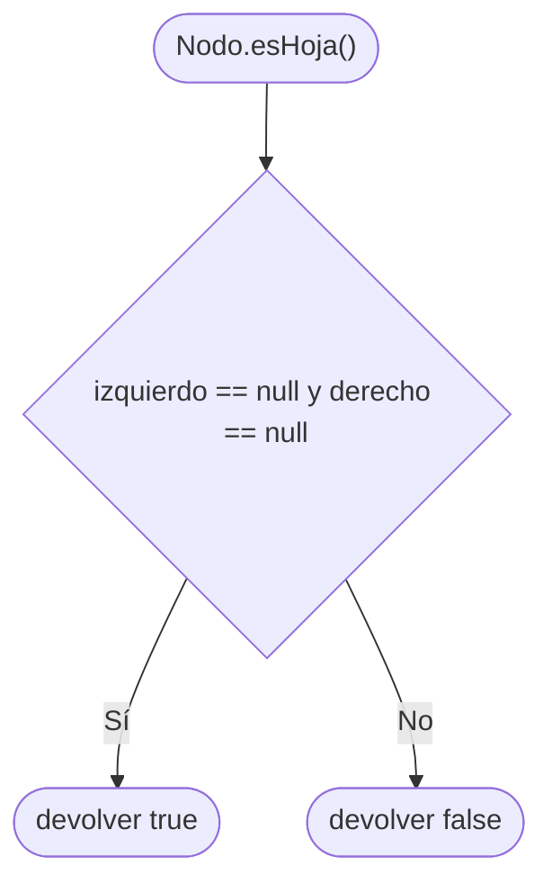

Un nodo es hoja solo cuando las dos referencias están vacías. Basta con que exista el hijo izquierdo o el derecho para que deje de ser hoja.

Ejemplo: un `Nodo` recién creado con `"A"` es hoja. Después de `setIzquierdo`, `esHoja()` devuelve `false`.

### Método grado()  
Paquete principal: arboles | Capa: modelo | Paquete: arboles.modelo | Clase: Nodo | Archivo: src/arboles/modelo/Nodo.java

Firma: `public int grado()`

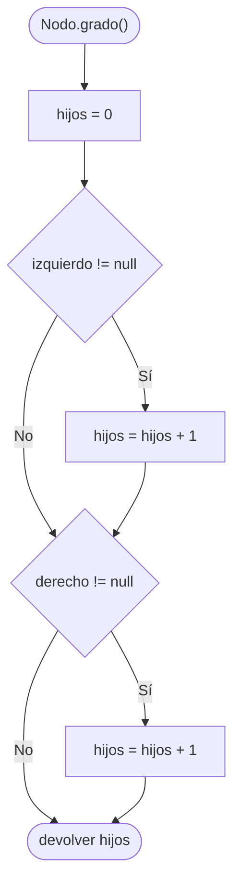

El grado es la cantidad de hijos directos. El método mira el lado izquierdo y el lado derecho por separado, así que el resultado solo puede ser 0, 1 o 2. No recorre el resto del árbol.

Ejemplo: un nodo nuevo tiene grado 0. En la demostración, `GYE` tiene grado 2 (CUE y LOH) y `MEC` tiene grado 1 (solo ESM).

## Capa negocio, clase ArbolBinario

`esVacio()` devuelve `raiz == null`. Es una comparación directa, sin recorridos ni errores, y por eso no tiene diagrama propio. El árbol recién construido está vacío.

### Método crearRaiz(dato)  
Paquete principal: arboles | Capa: negocio | Paquete: arboles.negocio | Clase: ArbolBinario | Archivo: src/arboles/negocio/ArbolBinario.java

Firma: `public Nodo<T> crearRaiz(T dato)`

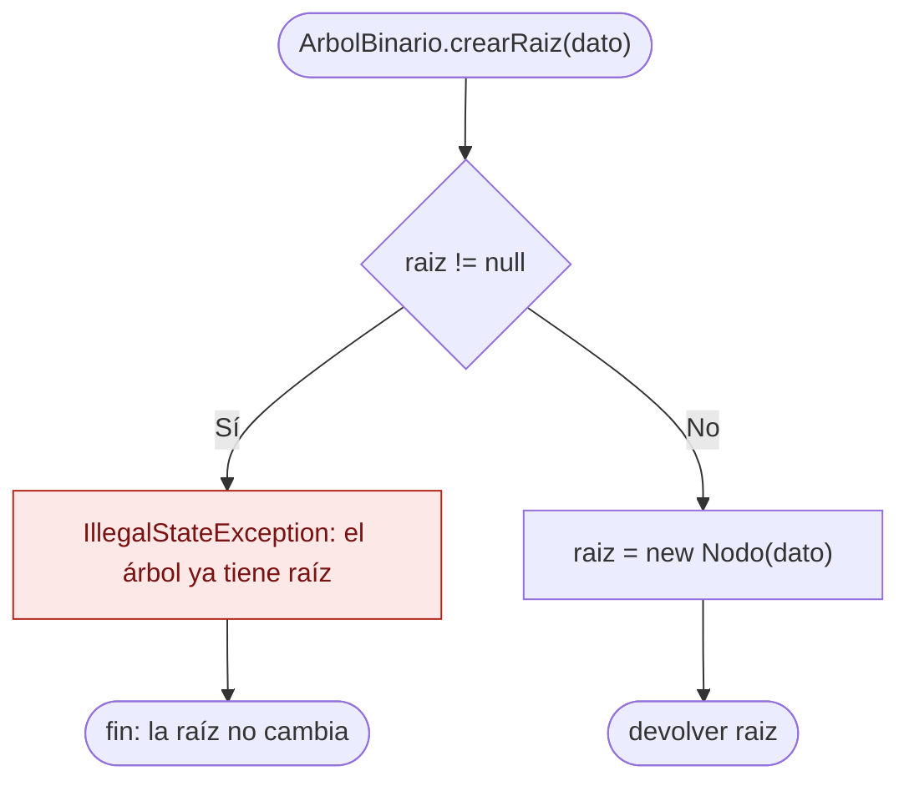

Solo el primer llamado crea la raíz. El segundo no sustituye el dato: lanza `IllegalStateException` con el mensaje `el árbol ya tiene raíz`. El método devuelve el mismo nodo que quedó guardado en `raiz`.

Ejemplo: `crearRaiz("UIO")` deja la raíz en UIO y la devuelve. Llamarlo otra vez con `"OTRO"` lanza el error y la raíz sigue siendo UIO.

### Método agregarIzquierdo(padre, dato)  
Paquete principal: arboles | Capa: negocio | Paquete: arboles.negocio | Clase: ArbolBinario | Archivo: src/arboles/negocio/ArbolBinario.java

Firma: `public Nodo<T> agregarIzquierdo(Nodo<T> padre, T dato)`

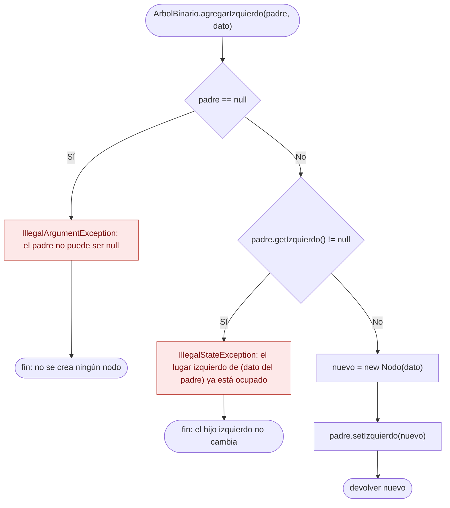

El padre se revisa antes que el lugar. Si `padre` es `null`, el mensaje es `el padre no puede ser null`. Si ese padre ya tiene hijo izquierdo, el mensaje incluye su dato, por ejemplo `el lugar izquierdo de UIO ya está ocupado`. Solo cuando el lugar está libre se crea el nodo, se engancha y se devuelve.

Ejemplo: `agregarIzquierdo(uio, "GYE")` devuelve el nodo GYE. Repetir la llamada con el mismo padre lanza el error y GYE sigue siendo el hijo izquierdo.

### Método agregarDerecho(padre, dato)  
Paquete principal: arboles | Capa: negocio | Paquete: arboles.negocio | Clase: ArbolBinario | Archivo: src/arboles/negocio/ArbolBinario.java

Firma: `public Nodo<T> agregarDerecho(Nodo<T> padre, T dato)`

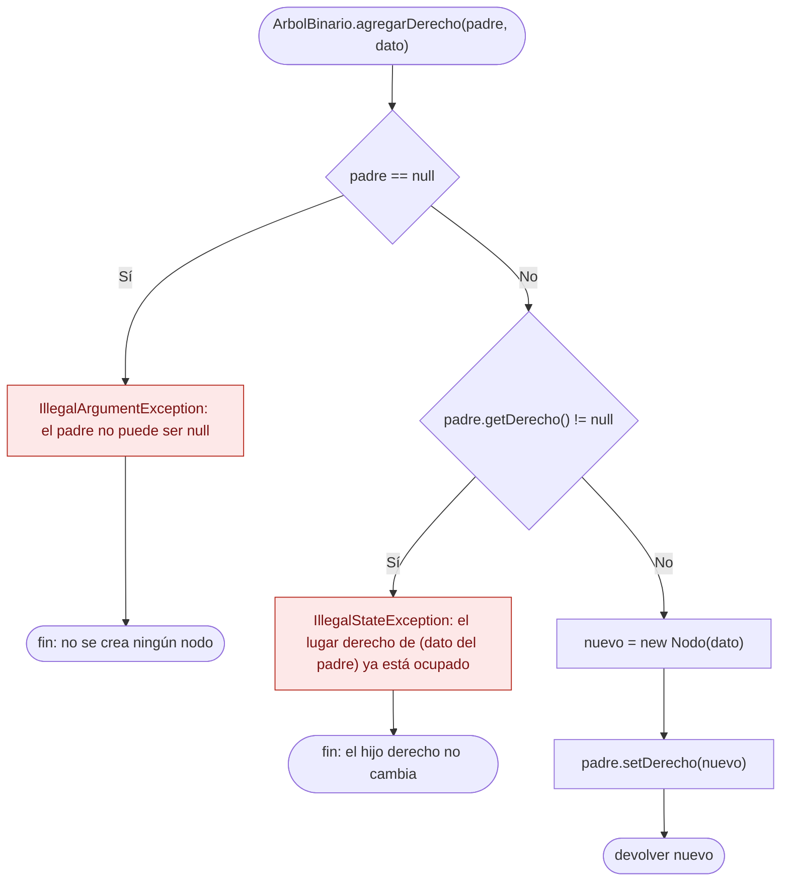

Hace el mismo control que `agregarIzquierdo`, sobre el otro lado. El mensaje de lugar ocupado es `el lugar derecho de ` seguido del dato del padre y de ` ya está ocupado`. Un error en el lado derecho no modifica el lado izquierdo.

Ejemplo: `agregarDerecho(uio, "MEC")` devuelve MEC. Si `padre` llega en `null`, se lanza `IllegalArgumentException` y el árbol queda igual.

### Método contarNodos()  
Paquete principal: arboles | Capa: negocio | Paquete: arboles.negocio | Clase: ArbolBinario | Archivo: src/arboles/negocio/ArbolBinario.java

Firma: `public int contarNodos()`

El método público solo delega. El recorrido está en `private int contarNodos(Nodo<T> nodo)`.

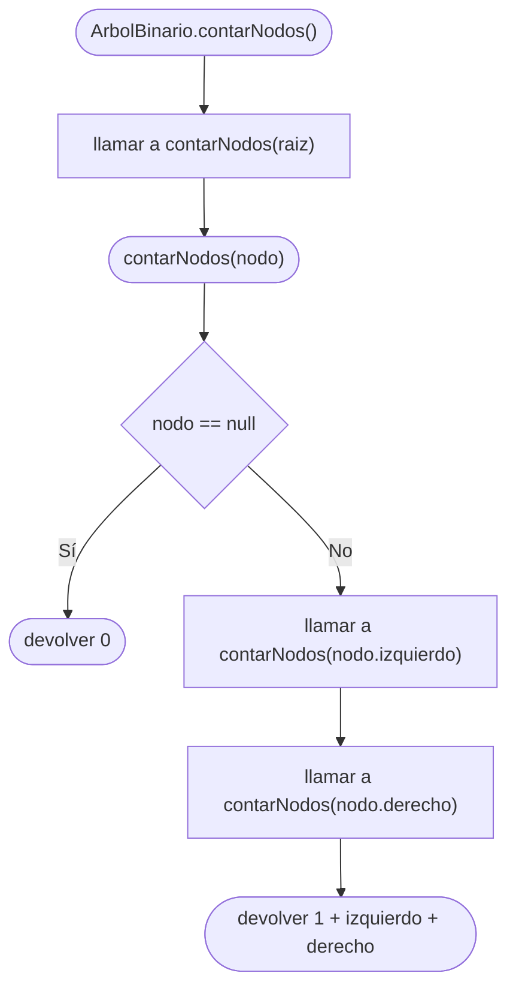

Cada nodo cuenta `1` y suma lo que devuelven sus dos lados. La llamada al hijo se hace aunque ese hijo sea `null`: el caso base convierte ese `null` en `0`. No hay excepción en este método.

Ejemplo: el árbol vacío devuelve `0`. Un solo nodo devuelve `1`. El árbol de la demostración (UIO, GYE, MEC, CUE, LOH, ESM) devuelve `6`.

### Método contarHojas()  
Paquete principal: arboles | Capa: negocio | Paquete: arboles.negocio | Clase: ArbolBinario | Archivo: src/arboles/negocio/ArbolBinario.java

Firma: `public int contarHojas()`

El método público delega en `private int contarHojas(Nodo<T> nodo)`.

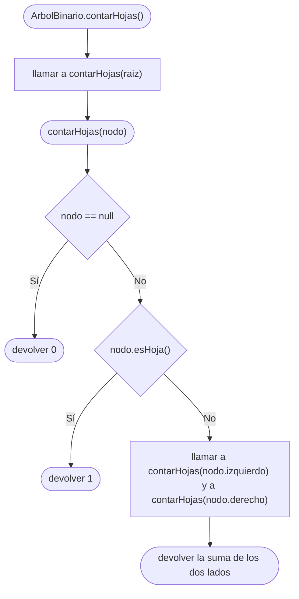

Un `null` aporta `0`. Una hoja aporta `1` y no sigue bajando. Un nodo con al menos un hijo no se cuenta como hoja: se suman las hojas de los dos lados. Igual que en `contarNodos`, el lado vacío se visita y devuelve `0`.

Ejemplo: el árbol vacío tiene `0` hojas. Un solo nodo tiene `1`. En la demostración las hojas son CUE, LOH y ESM, así que `contarHojas()` devuelve `3`.

### Método altura()  
Paquete principal: arboles | Capa: negocio | Paquete: arboles.negocio | Clase: ArbolBinario | Archivo: src/arboles/negocio/ArbolBinario.java

Firma: `public int altura()`

El método público delega en `private int altura(Nodo<T> nodo)`.

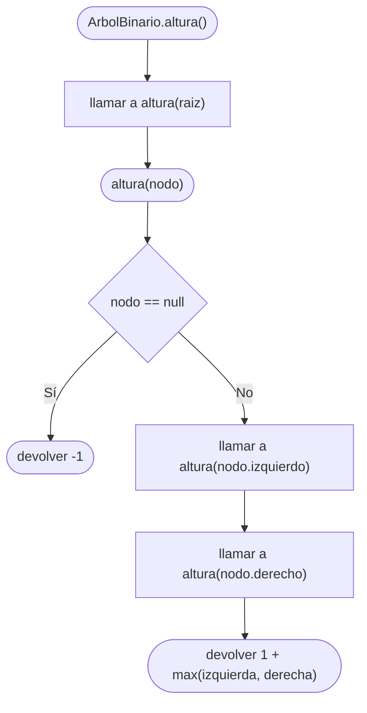

El caso base no es `0`. Un hijo inexistente mide `-1`, y cada nodo real suma `1` al lado más largo. Por eso la altura cuenta aristas, no nodos. Las dos llamadas recursivas se hacen siempre que el nodo existe.

Ejemplo: la altura del árbol vacío es `-1` y la de un solo nodo es `0`. El árbol de la demostración mide `2`. El árbol A del reto mide `3`.

## Capa app, clase VistaArbol

### Método mostrar(arbol)  
Paquete principal: arboles | Capa: app | Paquete: arboles.app | Clase: VistaArbol | Archivo: src/arboles/app/VistaArbol.java

Firma: `public static <T> void mostrar(ArbolBinario<T> arbol)`

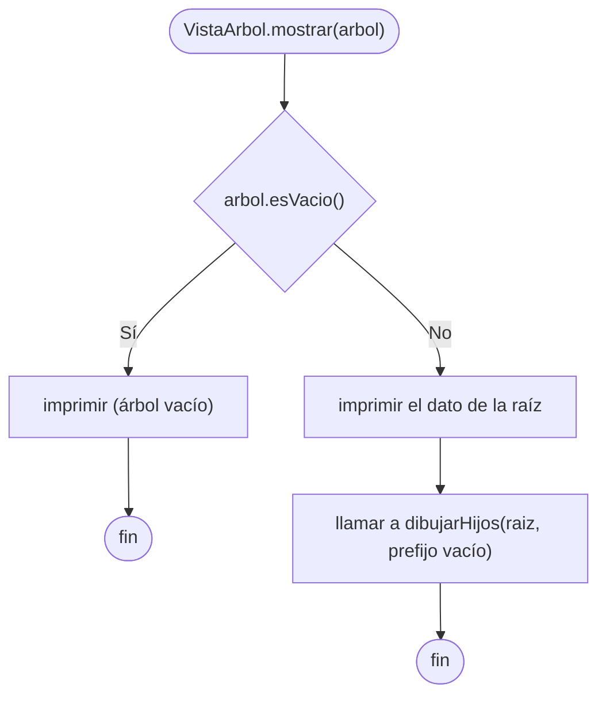

Si no hay raíz, imprime exactamente `(árbol vacío)` y no llama a `dibujarHijos`. Si hay raíz, imprime su dato en la primera línea y delega el dibujo de los hijos con el prefijo vacío.

Ejemplo: `mostrar` de un `ArbolBinario` nuevo imprime `(árbol vacío)`. Con la raíz UIO, la primera línea es `UIO` y las siguientes salen de `dibujarHijos`.

### Método dibujarHijos(nodo, prefijo)  
Paquete principal: arboles | Capa: app | Paquete: arboles.app | Clase: VistaArbol | Archivo: src/arboles/app/VistaArbol.java

Firma: `private static <T> void dibujarHijos(Nodo<T> nodo, String prefijo)`

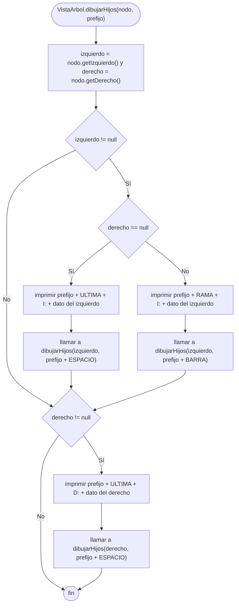

El hijo izquierdo se imprime solo si existe. Si además no hay hijo derecho, ese izquierdo es la última rama y usa `ULTIMA`. Si hay derecho, el izquierdo usa `RAMA` y el prefijo de sus descendientes lleva `BARRA`, para seguir la línea vertical. El hijo derecho, cuando existe, siempre es la última rama y sus descendientes avanzan con `ESPACIO`. `UNICODE` vale `false`, así que esas constantes ya están en ASCII: `+-- `, la rama final, `|   ` y cuatro espacios. Una hoja no imprime nada, porque sus dos hijos son `null`.

Ejemplo: bajo UIO, GYE no es el último hijo, así que su línea empieza con `+-- I: GYE`. MEC sí es el último y su línea empieza con la rama final y `D: MEC`.

### Método mostrarGrafico(arbol)  
Paquete principal: arboles | Capa: app | Paquete: arboles.app | Clase: VistaArbol | Archivo: src/arboles/app/VistaArbol.java

Firma: `public static <T> void mostrarGrafico(ArbolBinario<T> arbol)`

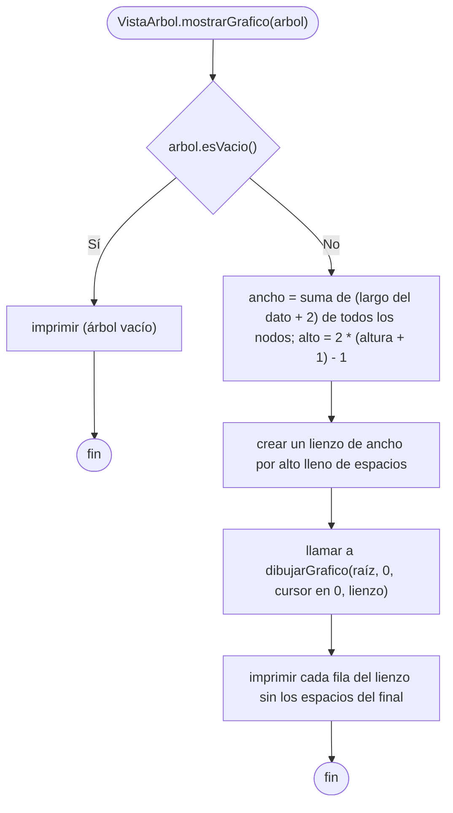

Es la segunda forma de dibujar el árbol. Primero calcula el tamaño del lienzo: cada nodo ocupa el largo de su dato más dos espacios, y cada nivel ocupa dos filas, una para los datos y otra para las ramas. Después `dibujarGrafico` escribe los datos y las ramas en el lienzo, y al final se imprime fila por fila. Un árbol vacío imprime `(árbol vacío)`, igual que `mostrar`.

Ejemplo: el árbol de la demostración tiene altura 2, así que el lienzo tiene 5 filas. UIO queda en la fila 0, GYE y MEC en la fila 2, y CUE, LOH y ESM en la fila 4.

### Método dibujarGrafico(nodo, nivel, cursor, lienzo)  
Paquete principal: arboles | Capa: app | Paquete: arboles.app | Clase: VistaArbol | Archivo: src/arboles/app/VistaArbol.java

Firma: `private static <T> int dibujarGrafico(Nodo<T> nodo, int nivel, int[] cursor, char[][] lienzo)`

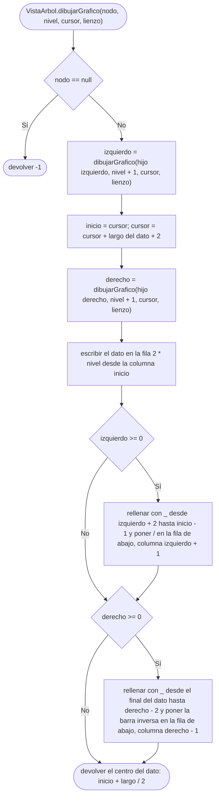

El método recorre el árbol en orden: primero el subárbol izquierdo, después el nodo y por último el subárbol derecho. El cursor avanza de izquierda a derecha, por eso un nodo nunca se escribe encima de otro y los hijos quedan debajo de su padre. Cada llamada devuelve la columna central de su dato, y el padre la usa para dibujar la rama hacia ese hijo. Si el nodo es `null` devuelve `-1`, que significa que no hay hijo y no se dibuja rama.

Ejemplo: en la cadena B cada nodo solo tiene hijo derecho, así que cada fila solo lleva una barra inversa y el dibujo baja en escalera hacia la derecha.

## Capa app, clase ConsolaArbol

### Método agregar(entrada, arbol, izquierdo)  
Paquete principal: arboles | Capa: app | Paquete: arboles.app | Clase: ConsolaArbol | Archivo: src/arboles/app/ConsolaArbol.java

Firma: `public static void agregar(Scanner entrada, ArbolBinario<String> arbol, boolean izquierdo)`

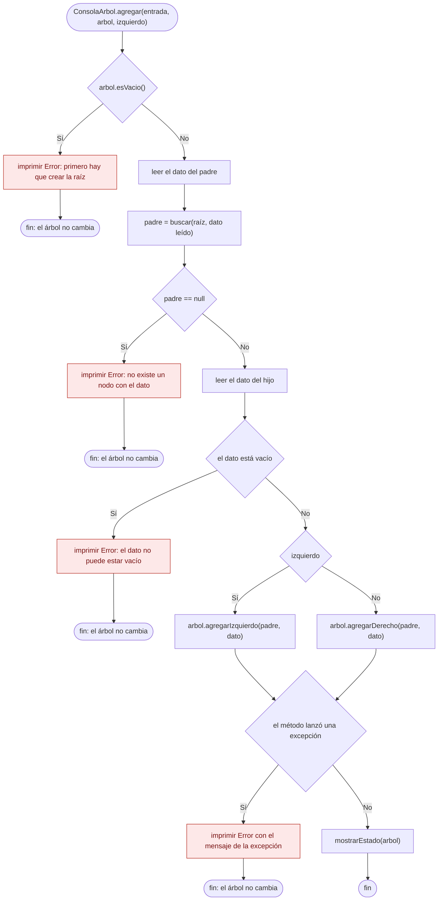

Es lo que hacen las opciones "Agregar hijo izquierdo" y "Agregar hijo derecho" del menú. El padre no se elige con una referencia sino escribiendo su dato, y `buscar` lo localiza recorriendo el árbol. Todos los errores se imprimen y vuelven al menú: ninguno cierra el programa ni modifica el árbol. El error de lugar ocupado viene de `ArbolBinario`, con el mismo mensaje de siempre. Cuando todo sale bien, `mostrarEstado` dibuja el árbol en forma gráfica e imprime la cantidad de nodos, hojas y la altura.

Ejemplo: con la raíz UIO y GYE a su izquierda, `agregar` con padre `UIO` y dato `XXX` por el lado izquierdo imprime `Error: el lugar izquierdo de UIO ya está ocupado` y el árbol sigue con 2 nodos.

## Paquete reto, clase MainRetoSolucion

### Método esCadena(arbol)  
Paquete principal: reto | Capa: no aplica | Paquete: reto.solucion | Clase: MainRetoSolucion | Archivo: src/reto/solucion/MainRetoSolucion.java

Firma: `public static boolean esCadena(ArbolBinario<String> arbol)`

La plantilla equivalente es `static boolean esCadena(ArbolBinario<String> arbol)` en `src/reto/MainReto.java`. Hoy devuelve `false` sin consultar el árbol. El diagrama corresponde a la solución, que es el comportamiento pedido en el reto.

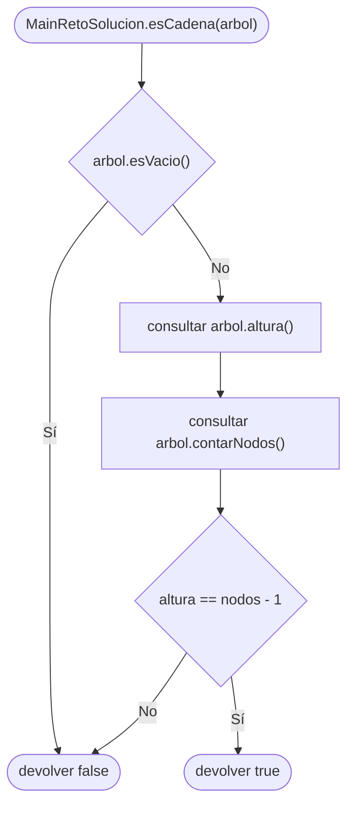

El árbol vacío se descarta antes de aplicar la fórmula. En cualquier otro caso el método no recorre los nodos por su cuenta: usa la altura y la cantidad de nodos que ya calcula `ArbolBinario`. Da `true` solo cuando hay un único camino, porque cada nodo nuevo alarga la altura en una arista.

Ejemplo: el árbol vacío devuelve `false`. Un solo nodo devuelve `true`, porque `0 == 1 - 1`. El árbol A del reto devuelve `false` (`3 == 8 - 1` no se cumple). El árbol B devuelve `true` (`4 == 5 - 1`).
