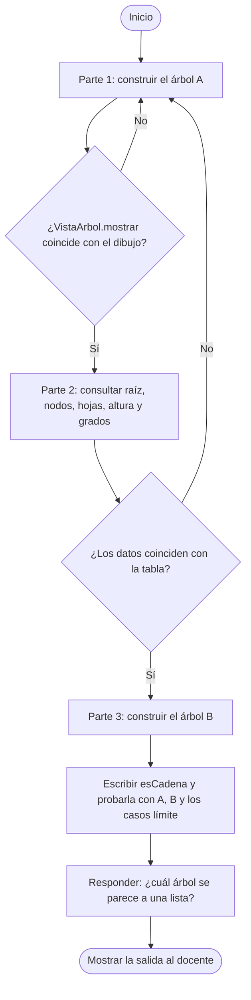

# Reto: ¿árbol sano o árbol en cadena?

Estructura de Datos, Unidad 3, Grupo 1. Duración: 30 minutos, en parejas o tríos.

Trabajan solo en `src/reto/MainReto.java`. Las clases del paquete `arboles` (`Nodo`, `ArbolBinario` y `VistaArbol`) ya están hechas y no se modifican.

## Material de apoyo

Antes de empezar, revisen lo que ya está hecho. No hay que programar estas operaciones, solo usarlas.

| Qué necesitan saber | Dónde verlo |
|---|---|
| Qué clases y métodos existen y cómo se relacionan | [Diagrama de clases](../../docs/DIAGRAMA-CLASES.md) |
| Cómo funciona por dentro cada operación (`esHoja`, `grado`, `crearRaiz`, `agregarIzquierdo`, `contarNodos`, `contarHojas`, `altura`) | [Diagramas de flujo por método](../../docs/DIAGRAMAS-FLUJO.md) |
| Cómo se usan las operaciones en un programa | `src/arboles/app/Main.java` |

## Flujo del reto

Así se organiza el trabajo. Cada paso se valida antes de pasar al siguiente.



## Compilar y ejecutar

```
javac -encoding UTF-8 -d out src/arboles/modelo/*.java src/arboles/negocio/*.java src/arboles/app/*.java src/reto/MainReto.java
java -cp out reto.MainReto
```

## Herramienta interactiva (opcional)

`MainRetoInteractivo` es un menú para probar sin escribir código: carga el árbol A o el B, deja construir un árbol propio escribiendo los datos y dibuja el árbol en forma gráfica después de cada cambio. La opción 9, `¿Es cadena?`, muestra lo que devuelve el `esCadena` que ustedes escriban en `MainReto`, junto con la altura y la cantidad de nodos.

```
javac -encoding UTF-8 -d out src/arboles/modelo/*.java src/arboles/negocio/*.java src/arboles/app/*.java src/reto/MainReto.java src/reto/MainRetoInteractivo.java
java -cp out reto.MainRetoInteractivo
```

Mientras `esCadena` siga siendo la plantilla, la opción 9 devuelve `false`. No reemplaza las Partes 1, 2 y 3: sirve para comprobar el resultado.

## Reglas

1. Solo se usan `Nodo` y `ArbolBinario` del paquete `arboles`.
2. Está prohibido usar estructuras de `java.util` basadas en árboles: `TreeSet`, `TreeMap`, `PriorityQueue`, `NavigableSet` y `NavigableMap`.
3. Pueden usar `VistaArbol.mostrar(arbol)` o `VistaArbol.mostrarGrafico(arbol)` para comprobar que su árbol coincide con el dibujo.

## Parte 1: construir (10 min)

Construyan el árbol A con `crearRaiz`, `agregarIzquierdo` y `agregarDerecho`. Cada flecha `I` es un hijo izquierdo y cada flecha `D` un hijo derecho.

```
LTX
+-- I: ATF
|   +-- I: TUA
|   `-- D: IBB
`-- D: MCH
    +-- I: SNC
    |   `-- I: LGQ
    `-- D: OCC
```

## Parte 2: consultar (8 min)

Impriman estos datos del árbol A:

| Dato | Resultado esperado |
|---|---|
| Raíz | LTX |
| Cantidad de nodos | 8 |
| Cantidad de hojas | 4 |
| Altura | 3 |
| Grado de LTX | 2 |
| Grado de SNC | 1 |

## Parte 3: decidir (12 min)

1. Construyan el árbol B:

```
GPS
`-- D: SCY
    `-- D: MRR
        `-- D: PTZ
            `-- D: TPN
```

2. Escriban en `MainReto` el método `esCadena(ArbolBinario<String> arbol)`.
   Un árbol es una cadena cuando su altura es igual a su cantidad de nodos menos 1.
3. Prueben `esCadena` con el árbol A y con el árbol B.
4. Respondan: ¿cuál de los dos se parece a una lista y qué pasaría al buscar un dato en él?

## Casos límite que deben probar

| Caso | Resultado esperado de `esCadena` |
|---|---|
| Árbol vacío | `false` (primero revisen `esVacio()`) |
| Árbol de un solo nodo | `true` |
| Agregar un hijo donde ya hay uno | Debe mostrarse el mensaje de error de `ArbolBinario`, sin que se caiga el programa |

Pista: en un árbol vacío la altura es -1 y la cantidad de nodos es 0. La fórmula daría "es cadena" si no revisan `esVacio()` antes.

## Entrega

Muestren su salida en consola al docente. Si terminan antes, sigan desde la raíz el camino I, D, I en el árbol A usando `getIzquierdo()` y `getDerecho()` e indiquen qué aeropuerto encuentran.
